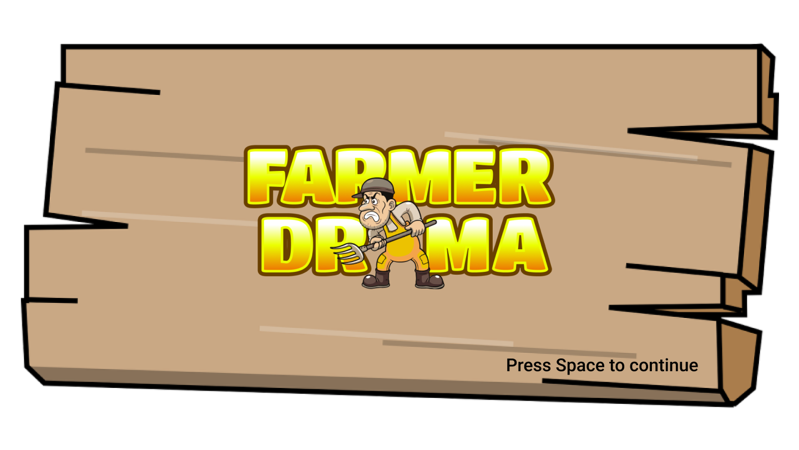

# Farmerdrama

## Story
Nicht schon wieder diese verdammten Waschbären vor dem Haus. Ich will doch nur in Ruhe Frühstücken bevor ich arbeiten gehen. Mir reicht es, ich mache jetzt kurzen Prozess.

*boom*

Oh, nein. Musste sie gerade in dem Moment vorbeilaufen.
Ich hab sie nicht gesehen...
Es war ein Unfall...

Naja, der Knall war ziemlich laut, die Polizei kommt wahrscheinlich bald, besser ich versteck sie, bis ich weiß was ich mache.

## Spielbeschreibung
In dem Spiel geht es darum, dass ein Farmer seine Frau umgebracht hat, und den Körper vor der immer wiederkehrenden Polizei verstecken muss.
Zusätzlich muss er sich noch um die Farm kümmern und Weizen anpflanzen, um damit die Schweine zu füttern.

## Build and Test
Das Programm lässt sich mit dotnet bauen und ausführen. Alle Dependencies werden mit eingebunden und müssen nicht separat installiert werden.

`dotnet restore` - Stelle alle dotnet dependencies wieder her.

`dotnet build` - Kompilieren

`dotnet run --project FarmGame` - Führe das Spiel aus

`dotnet test` - Software-Tests ausführen.

## Platform
Das Spiel wurde mit dotnet unter Linux entwickelt. Es sollte auch auf Windows funktionieren, konnte dort aber nicht so ausführlich getestet werden.